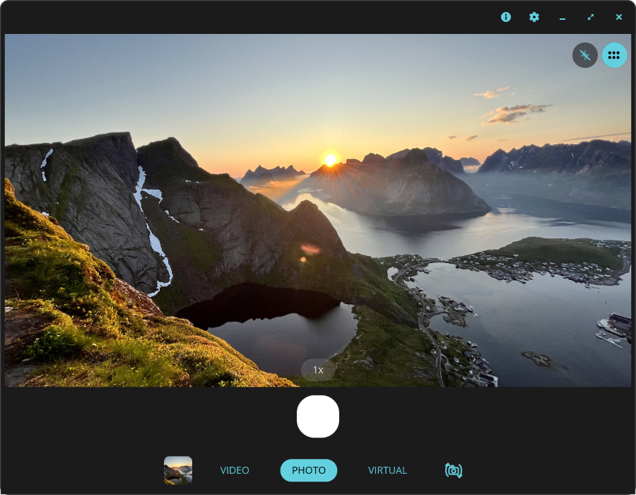

# Camera

[](https://flathub.org/apps/io.github.cosmic_utils.camera)
[](https://github.com/cosmic-utils/camera/actions/workflows/ci.yml)
[](https://github.com/cosmic-utils/camera/actions/workflows/release.yml)

A camera application for the [COSMIC](https://github.com/pop-os/cosmic-epoch) desktop environment.



[View more screenshots](preview/README.md)

## Status

This is a personal project by [Frederic Laing](https://github.com/FreddyFunk). It is not affiliated with or endorsed by System76. The application may be contributed to System76 or the COSMIC project in the future if there is interest.

## Installation

### Flatpak (Recommended)

<a href='https://flathub.org/apps/io.github.cosmic_utils.camera'></a>

```bash
# Install from Flathub
flatpak install flathub io.github.cosmic_utils.camera

# Or install from a downloaded .flatpak bundle
flatpak install camera-x86_64.flatpak
```

### From Source

#### Dependencies

- Rust (stable)
- [cosmic-icons](https://github.com/pop-os/cosmic-icons)
- GStreamer 1.0 with plugins (base, good, bad, ugly)
- libcamera (>= 0.4.0)
- cmake (for building embedded libjpeg-turbo)
- libwayland
- libxkbcommon
- libinput
- libudev
- libseat

#### Build

```bash
# Install just command runner
cargo install just

# Build release binary
just build-release

# Install to system
sudo just install
```

## CLI Usage

The camera application supports several command-line modes for headless operation:

```bash
camera              # Launch GUI (default)
camera --help       # Show help
camera list         # List available cameras
camera photo        # Take a photo
camera video        # Record a video
camera terminal     # Terminal mode viewer
```

### List Cameras

```bash
camera list
```

Shows available cameras with their supported formats:

```
Available cameras:

  [0] Laptop Webcam Module (V4L2)
      Formats: 1920x1080@30fps, 1280x720@30fps, 640x480@30fps
```

### Take a Photo

```bash
camera photo [OPTIONS]
```

**Options:**
- `-c, --camera <INDEX>` - Camera index from `camera list` (default: 0)
- `-o, --output <PATH>` - Output file path (default: ~/Pictures/camera/IMG_TIMESTAMP.jpg)

**Examples:**
```bash
camera photo                         # Quick photo with defaults
camera photo -o ~/snapshot.jpg       # Custom output path
camera photo -c 1                    # Use second camera
```

### Record a Video

```bash
camera video [OPTIONS]
```

**Options:**
- `-c, --camera <INDEX>` - Camera index from `camera list` (default: 0)
- `-d, --duration <SECONDS>` - Recording duration (default: 10)
- `-o, --output <PATH>` - Output file path (default: ~/Videos/camera/video_TIMESTAMP.mp4)
- `-a, --audio` - Enable audio recording

**Examples:**
```bash
camera video                         # 10 second video
camera video -d 30                   # 30 second video
camera video -d 60 -a                # 1 minute with audio
camera video -c 1 -d 30 -o out.mp4   # Camera 1, custom output
```

Press `Ctrl+C` to stop recording early.

### Process Images

Process images through computational photography pipelines.

```bash
camera process <MODE> [OPTIONS] <INPUT>...
```

#### Night Mode

Multi-frame denoising and HDR+ pipeline for low-light photography.

```bash
camera process night-mode [OPTIONS] <INPUT>...
```

**Arguments:**
- `<INPUT>...` - One or more image files (PNG, DNG) or a directory containing images

**Options:**
- `-o, --output <DIR>` - Output directory for processed images (default: `<input>/output` or `~/Pictures/camera`)

**Examples:**
```bash
camera process night-mode /path/to/burst/               # Process all images in directory
camera process night-mode img1.png img2.png img3.png    # Process specific files
camera process night-mode /path/to/burst/ -o /output/   # Custom output directory
```

The pipeline automatically:
- Selects the sharpest frame as reference
- Aligns all frames to the reference using GPU-accelerated pyramid alignment
- Merges frames using FFT-based frequency domain denoising
- Applies tone mapping with shadow recovery
- Outputs as DNG

### Terminal Mode (For the Brave)

Ever wanted to see your face rendered in glorious Unicode? Wonder what you'd look like as a half-block character? Well, wonder no more!

```bash
camera terminal
```


**Controls:**
- `s` - Switch camera (cycle through available cameras)
- `q` or `Ctrl+C` - Return to the real world

**Why does this exist?**
- SSH into your server and check if you left the oven on (assuming your oven has a camera)
- Finally achieve your dream of becoming ASCII art
- Prove to your coworkers that you *can* attend video calls from a TTY
- Because we could

**Note:** Your terminal needs true color support (most modern terminals have this). If you see a sad mosaic of wrong colors, try a different terminal emulator. Also, this won't make you more photogenic - trust us, we tried.

## Development

```bash
# Run with debug logging
just run

# Run with verbose debug logging
just run-debug

# Format code
just fmt

# Run all checks (format, cargo check, tests)
just check

# Run clippy lints
just clippy

# Run tests only
just test
```

### Cross-Compilation

Cross-compilation for other architectures uses [cross](https://github.com/cross-rs/cross) with custom Dockerfiles in `docker/`.

```bash
# Install cross
cargo install cross --git https://github.com/cross-rs/cross

# Debug build
cross build --target aarch64-unknown-linux-gnu

# Release build
cross build --release --target aarch64-unknown-linux-gnu
```

| Target | Dockerfile | Base |
|--------|-----------|------|
| `aarch64-unknown-linux-gnu` | `docker/Dockerfile.aarch64` | Ubuntu 25.04 |
| `armv7-unknown-linux-gnueabihf` | `docker/Dockerfile.armhf` | Ubuntu 25.04 |
| `riscv64gc-unknown-linux-gnu` | `docker/Dockerfile.riscv64` | Ubuntu 25.04 |
| `x86_64-unknown-linux-gnu` | `docker/Dockerfile.x86_64` | Ubuntu 25.04 |
| `x86_64-unknown-linux-musl` | `docker/Dockerfile.x86_64-musl` | Alpine |
| `aarch64-unknown-linux-musl` | `docker/Dockerfile.aarch64-musl` | Alpine + clang |

The configuration is in `Cross.toml`. Docker or Podman is required.

**Podman users:** If your system uses btrfs, configure the storage driver:

```bash
mkdir -p ~/.config/containers
printf '[storage]\ndriver = "btrfs"\n' > ~/.config/containers/storage.conf
podman system reset --force
```

If your kernel lacks the `tun` module (check with `modprobe tun`), pass host networking:

```bash
CROSS_BUILD_OPTS="--network=host" CROSS_CONTAINER_OPTS="--network=host" cross build --target ...
```

### Distrobox (Atomic Desktops)

For development on atomic/immutable desktops (Fedora Silverblue, Kinoite, Bazzite, etc.):

```bash
# Create the development container
distrobox assemble create

# Enter the container
distrobox enter camera-dev

# Build inside the container
just build-release

# Run the binary on the host (not inside distrobox)
# Camera access via PipeWire requires running on the host
./target/release/camera

# Remove when no longer needed
distrobox rm camera-dev
```

To run GUI apps from inside the container, allow local display access on your host:

```bash
xhost +si:localuser:$USER
```

Add this to `~/.distroboxrc` to make it permanent.

Note: Camera access requires PipeWire, which doesn't work reliably from inside containers. Build in distrobox, run on host for full functionality.

### Flatpak Development

```bash
# Full install (uninstalls old, installs deps if needed, builds and installs)
just flatpak-install

# Run the installed Flatpak
just flatpak-run

# Uninstall all Flatpak components
just flatpak-uninstall

# Individual steps (if needed)
just flatpak-deps   # Install Flatpak SDK/runtime
just flatpak-build  # Build and install Flatpak
just flatpak-clean  # Remove build artifacts
```

## Acknowledgments

The exposure controls implementation was inspired by [cameractrls](https://github.com/soyersoyer/cameractrls), a camera controls GUI for Linux.

### Night Mode Feature

The night mode photo feature implements a simplified version of the HDR+ algorithm, with implementation guidance from:

- **hdr-plus-swift** by Martin Marek ([GitHub](https://github.com/martin-marek/hdr-plus-swift)) - GPL-3.0
  - Hierarchical pyramid alignment with L1/L2 hybrid cost functions
  - FFT-based frequency domain merging
  - Spatial domain merge algorithm
  - Noise estimation techniques

- **Google HDR+ Paper** - "Burst photography for high dynamic range and low-light imaging on mobile cameras" (Hasinoff et al., SIGGRAPH 2016)
  - [Paper](https://www.hdrplusdata.org/hdrplus.pdf)

- **Night Sight Paper** - "Handheld Mobile Photography in Very Low Light" (Liba et al., SIGGRAPH Asia 2019)

## License

Licensed under the [GNU Public License 3.0](https://choosealicense.com/licenses/gpl-3.0).

### Contribution

Any contribution intentionally submitted for inclusion in the work by you shall be licensed under the GNU Public License 3.0 (GPL-3.0). Each source file should have a SPDX copyright notice at the top of the file:

```
// SPDX-License-Identifier: GPL-3.0-only
```

### Reporting Bugs

The easiest way to report a bug is to use the **"Report a Bug"** button in the app settings. This generates a detailed system report that helps with debugging.

1. Open Camera → Settings → "Report a Bug"
2. A bug report file will be saved to `~/Pictures/camera/`
3. Your browser will open the [bug report form](https://github.com/cosmic-utils/camera/issues/new?template=bug_report_from_app.yml)
4. Attach the generated report file and describe the issue

You can also [report bugs manually](https://github.com/cosmic-utils/camera/issues/new?template=bug_report.yml) if you prefer.

### Feature Requests

Have an idea for a new feature? [Submit a feature request](https://github.com/cosmic-utils/camera/issues/new?template=feature_request.yml)!
